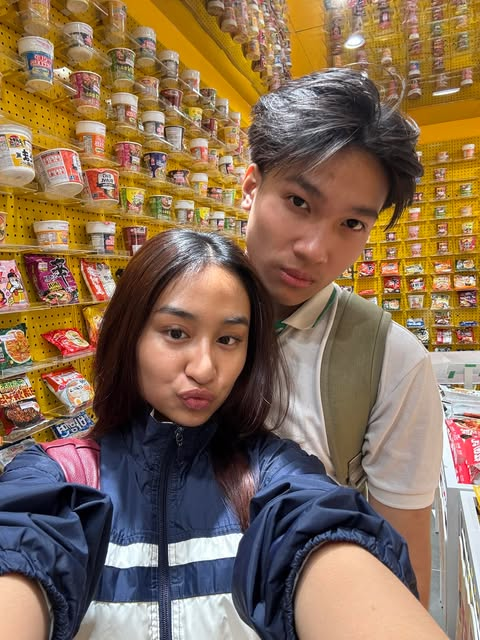

<!DOCTYPE html>
<html lang="en">
<head>
    <meta charset="UTF-8">
    <meta name="viewport" content="width=device-width, initial-scale=1.0">
    <title>I'm Sorry, My Pookiee Wookiee Bear</title>
    
    
</head>
<body>
    

        <h1>I'm Sorry, My Pookiee Wookiee Bear ❤️</h1>
        
Last night may have been tough, but it only made me realize how much I truly love you. Every moment with you is precious, and I never want to take you for granted. You are my sunshine, my safe place, my heart's home. I promise to love you endlessly, to cherish you always, and to fight for us no matter what. I am never tired of you, and I never will be. You mean the world to me, my Pookiee Wookiee Bear. ❤️

        <button class="button" onclick="showPhoto()">Stay With Me</button>
        <button class="button" onclick="showMessage()">Special Message</button>
        <button class="button" onclick="showExtraMessage1()">More Love</button>
        <button class="button" onclick="showExtraMessage2()">Forever Us</button>
        <button class="button" onclick="showExtraMessage3()">Always Yours</button>
        <button class="button" onclick="surpriseEffect()">Surprise Me</button>
        <button class="button" onclick="playMusic()">Play Romantic Music</button>
        <button class="button" onclick="startHeartAnimation()">Shower with Hearts</button>
    

    
</body>
</html>
